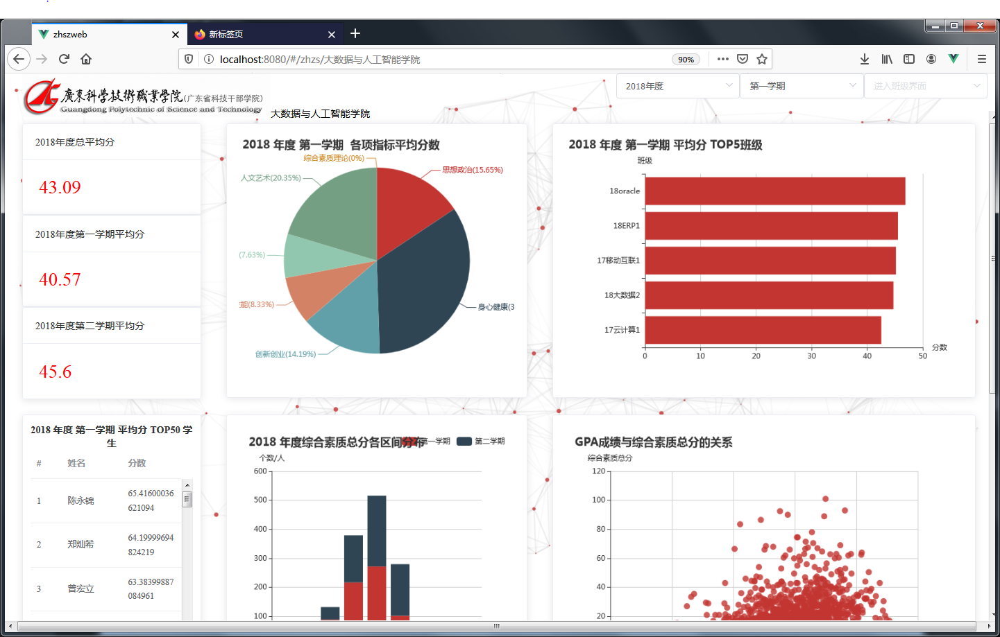
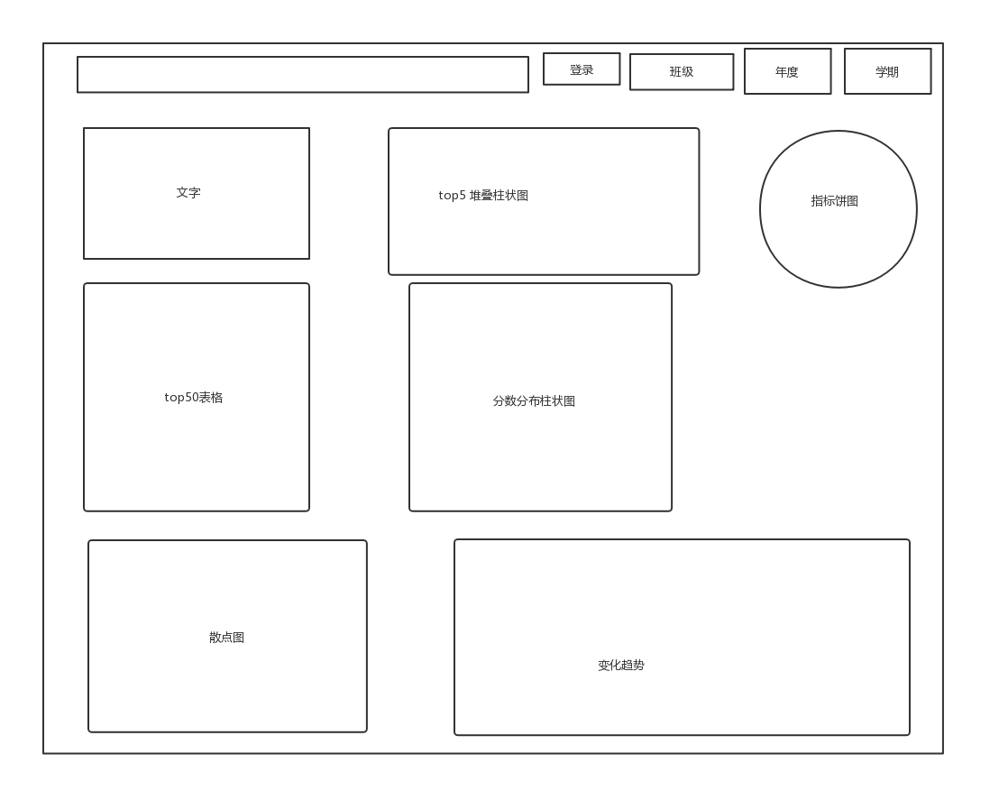
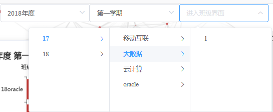

- 项目介绍(800字)
- 个人分工及技术岗位描述(200字)
- 主要成果(1200字)
- 实习总结收获(800字)
- 个人建议(400字)


## 个人分工及技术岗位描述

在项目里负责web前端的编写,和部分后端代码。前端负责包括前端界面的设计、约定前后端的图表数据结构。后端负责学院界面的数据查询和数据组装。前端使用的技术栈包括 前端框架`Vue.js`、`Node.js`、`axios`前后端的数据交互、`ECharts`的图表配置,`Element-UI` UI 框架。
主要工作是搭建前端的工程框架,设计页面的草图,根据草图的内容在网页上设计布局。根据需要绘制的图表在使用ECharts作图,作图的时候约定前后端的数据交换结构。最后将需要的数据和机构给后端,后端编写完后，进行连接测试。


## 主要成果

完成各个界面的编写
### 1. 后台数据管理界面

数据上传界面截图

数据上传界面主要功能为上传综合素质的原始Excel文件。包括上传新数据，获取已经上传的数据，删除数据功能。用户的信息管理也在这个界面，包括修改登录密码，退出登录。

- 上传文件自动解析文件名
  原始数据的每个Excel文件对应的是某个年度某个学期某个年级的全体人的综合素质分情况。提交数据到后台时需要告诉后台这个哪个年度哪个学期哪个年级的数据。前端提供了对应的三个选择框来选择，上传前需要选择和原始数据对应的选项，不然导入后台时会错乱。

  根据现有的原始数据的文件名，格式都为`2018-2018学年度第一学期学生综合素质测评分（2017级）.xls`,有个功能为根据文件名自动选择对应的选项框。用户选择对应的文件后,会获取原始文件名，从文件名里解析出年度，学期，年级信息，并自动勾选对应的选择框。


### 2. 可视化的界面

完成三个可视化界面的设计编写: 学院界面，班级界面，学生个人界面。

可视化界面截图(已学院界面为例)


- 界面草图设计
    为了方便前端界面的设计，先绘制好草图，开发时根据操作设计界面，编写前端的代码。

    设计各个界面的草图，下图为学院界面的草图
    

- 完成各个界面的布局
  根据草图的布局，设置各个界面的布局。设计每个图表在哪行哪列，宽度多少。
  使用`Element-UI`的栅格布局（支持响应式布局），将草图的设计展示在前端web界面上。

- 完成各个图表的配置项
  各个界面的图表数量都比较多，种类丰富，每张图表设置的数据又不一样。需要每张图表设置EChart的配置，使用测试数据显示图表。
  根据测试数据组装出图表需要的数据结构，这里的数据结构就是前后端交互的数据。需要设计成方便后端查询组装，和前端也方便调用的形式。

  例如 学院界面的数据格式的部分
  ```js
     basicCard:{
        "year_score":123,
        "term1_score":90,
        "term2_score":120
    },
    //某年度，某学期，所有 指标和对应的平均分  xx年y学期
    indexes:{
        //所有的指标
    indexes:["身心健康","思想政治","创新创业"],
    //上面指标对应的分数(平均分)
    scores:[100,200]
    },
    
  ```

- 连接前后端的数据
  对接前后端的数据，一开始使用测试数据设计布局和展示图表，在使用测试数据测试完后，也得出了前后端交互需要传递的数据结构。在后端查询出数据，组装成前端需要的数据，提供API接口。

  前端请求API接口，将测试数据显示为真实请求到的数据，最后展示真实数据的可视化结果。

### 5. 导航栏跳转

可视化页面的导航栏,可以方便的切换到各个班级的界面。

导航组件截图:


- 导航请求后台班级和年度数据
    导航组件的年度和班级信息为从后台请求回来的,根据年度，班级的数据也会相应的变化。如选择`2017`年度,就只有17,16,15三个年级的班级数据。
    班级通过`Element-UI`的 级联选择器(Cascader)实现，通过年级，专业，班级快速定位某个班级。
- 导航数据请求
  通过监听导航栏的选项框切换事件，切换年度或者学期时都会触发重新请求数据的事件。

### 4. 登录注册界面

本系统有登录注册功能，某些界面需要登录后才能查看

登录界面截图


- 未登录拦截
  未登录而打开需要登录的界面时，会重定向到登录界面。这里使用`axios`的登录拦截实现。

- 登录session保存
  登录成功后，后台会返回cookies到浏览器保存，每次请求都会携带cookies,后台再验证。如果失效后台会返回错误，重定向到登录界面。

- 注册密码强度验证
  在前端和后端都有验证密码长度，密码长度不一致，会显示错误
- 密码修改
  提供密码修改入口(在数据管理后台界面)

## 实习总结收获

通过这次的项目，对一个完整项目的开发流程有了一个清楚的认识。开发一个系统需要的前端,后端，数据库，在这个项目里都用到。不仅开发技术得到提高，对于一个项目开发的团队合作分工的重要性也有了理解。

这次的项目为前端端分离的项目，虽然是分开，但是联系也很深。前后端可以各做各的，但也有项目依赖。首先项目的大体是大家一起讨论的，和需要绘制的图表数据。讨论完后，就开始分工。

前端根据需要的图表绘制草图，和设计页面。后端则设计数据库，测试导入解析原始数据,两边双管齐下。调试完后就将数据结构给后端，后端根据数据结构编写查询。

经过这次,对GIT版本管理工具的使用有了一个在完整项目里使用的经历。这个项目一开始就采用了GIT来管理项目。因为是多人协助开发一个工程，GIT是无二的选择。用到了创建GIT仓库,提交commit,合并分支等操作。

接触到了前端开发的完整的技术栈，项目使用的是流行的前端框架`Vue.js`,接触到了Node.js,npm这些。从创建项目到,前端调试，前端UI布局，最后前后端连接调试，vue前端项目部署到Flask中。
这是第一个完整的项目，从项目开始需求分析到开发，到最后开发文档编写，经历了一个项目的完整开发流程。
前后端的数据交互,前后端的数据交互涉及到前端和后端，一开始由前端制定数据的基本结构，再由后端编写查询语句，查询数据库，构造数据格式。前端一开始制定的格式往往不是最好的，需要后台在实际查询组装数据时，慢慢调整,需要前后端交流。
通过这个毕业前的大项目，收获到了很多，项目历时两个月，从一开始的需求分析到现在的成品。收获到的出来在硬盘上的前端代码，后端代码，设计图，文档。还有在自己的技术的提升，对完整项目的开发流程，前后端技术都有了比较深入的了解,扩大了自己的知识面。这些在以后的工作中，一定会发挥很大的作用。


## 个人建议(400字)

这个项目是个完整的项目，涉及到了前端后端数据库的技术，作为自己的第一个完整项目,自我感觉是非常好的，学习到了以前没用过的技术，现在已经在这段时间里尽力做到最好了，但是也有一点小瑕疵。

用户机制不完善。现在用户机制没有明确的权限区分，任意注册的用户登录后，可以上传数据删除数据。建议添加用户权限管理。

图表数据较少。由于原始数据少，某些图表(年度平均分变化)展示的信息少。设计些更好的图表。

后期维护成本高。由于每张图表都需要前端设计数据结构，和图片配置，后端也要响应的添加查询语句，所有后期如果想添加一个新的分析图表，工作量较大，需要同时修改前后端代码。设计一个方便修改维护的项目结构。

后端数据解析有局限性。后端解析的execl只能符合现有数据的格式，如果不符合，可能会解析不了。建议添加一个高级点的数据处理界面。

图表样式颜值不高。图表样式使用ECharts原始的样式，颜值不高。很多ECharts的高级点的组件没有应用到。建议在修改一个符合现在`Element-Ui`的主题,在符合图表功能的基础上添加更多ECharts图表组件。

如果上面的都能修改优化，项目会更加完善，完整。


