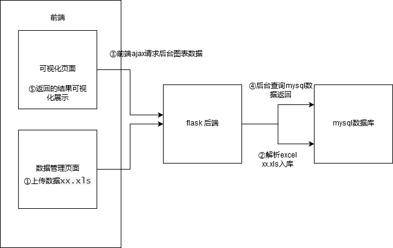
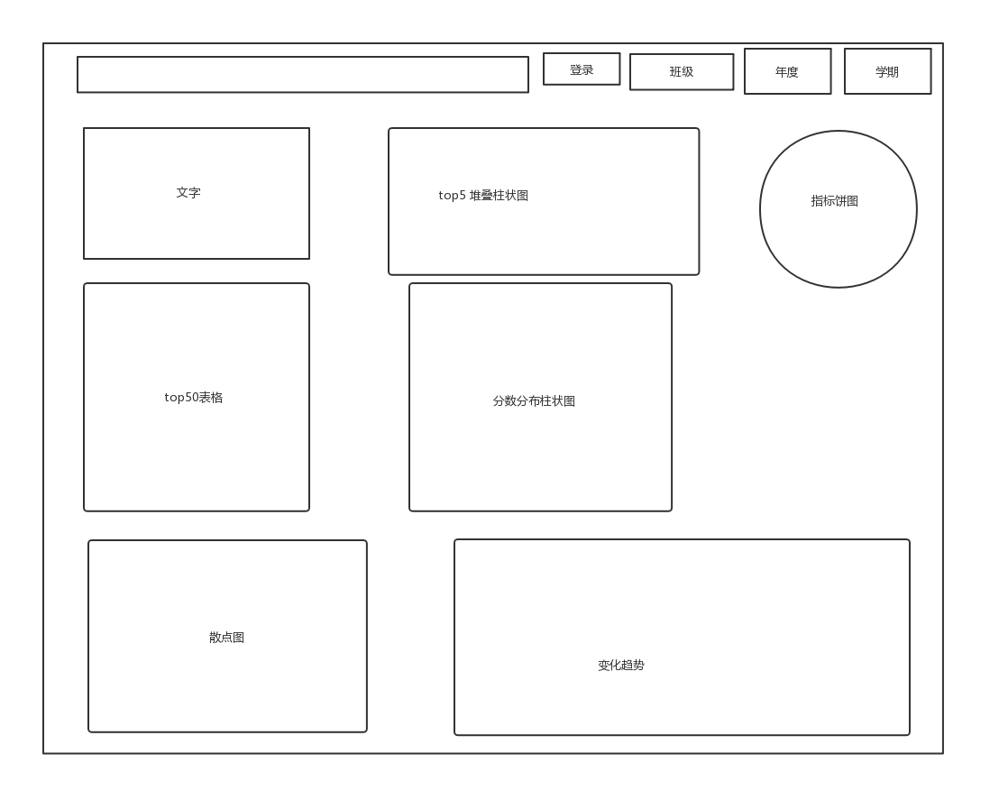
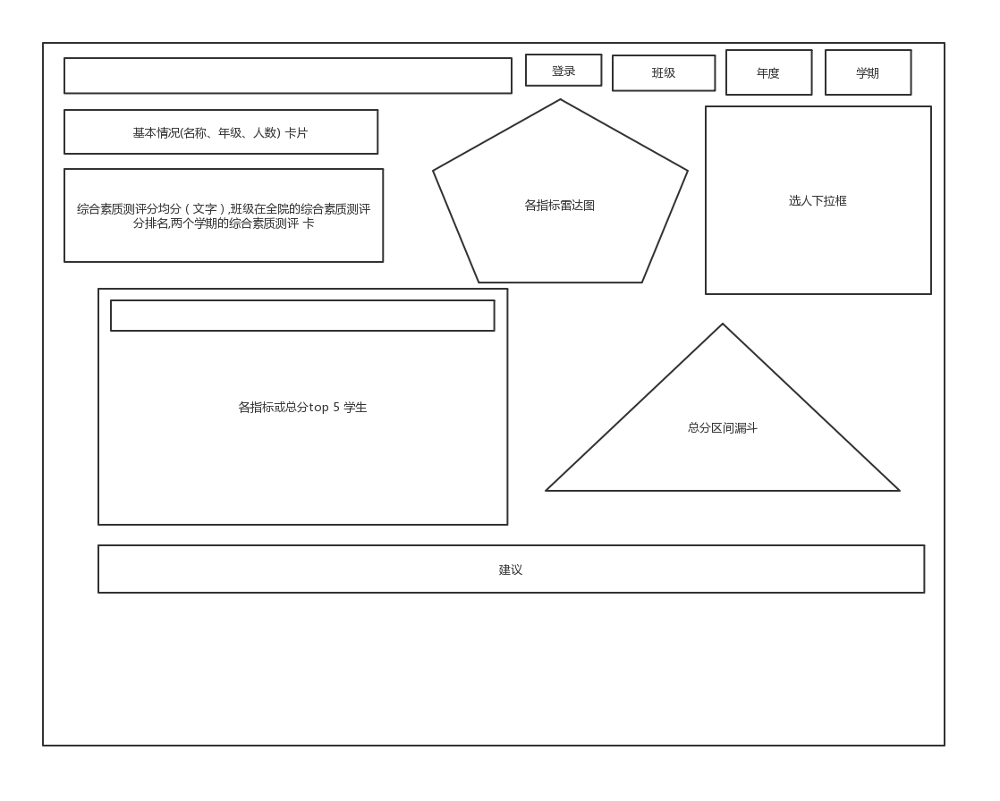
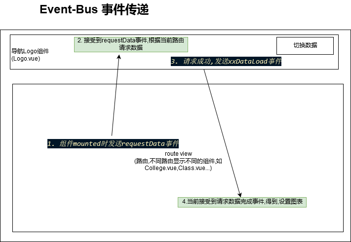

### 主要功能模块开发过程
- 整体开发过程
  - 架构图
  - 使用git版本管理系统管理项目
- 主要功能模块
  - 前端可视化功能
    - 搭建前端项目基本框架
      - 使用vue-CLI 构建项目骨架
      - 引入相关的依赖
      - 编写各个界面路由组件
      - 封装基本http请求api
      - 编写路由跳转,数据传递
      - 编写导航组件
    - 页面布局和图表配置
      - 编写界面图表
      - 根据需要的图，使用测试数据画出图表
    - 后台数据查询api接口编写
      - 后台创建数据库,表
      - 根据前端测试数据的数据格式,编写后端查询数据库语句
  - 前后端连接
  
    - 可视化导航组件
      - 导航功能
      - 和可视化页面数据交互(->EventBus)
  - 用户登录注册
    - 未登录拦截
    - 登录注册
    - 修改密码
    - 用户session
  - 数据导入,数据解析 功能
    - 上传数据，获取已上传数据, 删除
    - 前端数据上传
    - 后端处理excel
    - 导入数据库
  - 编译部署
      - 前后端数据交互 跨域问题
    - Flask 合并 前端代码
    - 编译部署


## 搭建前端可视化项目基本框架
### 项目整体架构

### 使用Vue-CLI 构建项目骨架

>Vue-CLI 是 Vue.js 开发的标准工具,用来创建项目的基本骨架

`vue create zhszweb`

###  引入相关的依赖

在`main.js`引入基本的依赖,如 `Element-UI`,`axios`,`vue-router`等

- 定义`vue-echarts`图表组件

  后面定义一个图表都用`v-chart`来表示

  ```js
  Vue.component('v-chart',ECharts)
  ```

###  编写各个界面路由组件

> 使用 Vue Router 实现各页面之间的跳转。Vue Router 是 Vue.js 官方的路由管理器。

路由和 URL 的映射主要在  `router.js`  文件,浏览器上访问不同的URL，就会将页面的主页面替换为相应的`组件`
 ```javascript
 const routes =[
    {
  path:"/zhzs/:collegeid",component:College,name:"college"
    },
    {
      path:"/zhzs/:collegeid/:classid/:studentid",component:Student,name:"student"
    },
    {
 省略..
  
 ```
- 封装基本http请求api

    图表数据和导航的数据需要从`Flask`后端请求,这就涉及到ajax请求，这里前端请求使用的是`axios`。为了方便调用，将常用的get和post请求封装成函数,封装的代码在`src\api\http.js`。

    1. 封装 get 和 post 方法

    2. 设置全局的请求拦截器
        拦截所有请求失败的请求,判断错误码,比如错误码为`401`就未登录,就重定向到登录界面
        `http.js`
## 页面布局和图表配置

根据需要画各个界面的图表，在各个界面使用测试数据显示图表

### 列出需要显示的图表列表
   根据数据集的字段，和要分析的维度,列出要显示的图表列表。
   图表列表(以学院界面为例)：

  ```
  - 年度和两个学期的综合素质测评平均分（文字） 卡片card

  - 各个指标测评分均分（饼图联动）

	标题: xx年度第y学期 各项指标平均分数
	某个学期的某个各项指标的全部人的平均分

	选某个指标就切换某个指标的数据，不选就全部指标平均分的top
..省略
  ```

###  绘制界面草图

  界面草图描述了需要的图表在界面中的大概位置,下面为三个主要的可视化界面的草图

  
  
  

###  使用Element-UI实现草图的布局

   前端UI框架使用`ElementUI`,用它提供的栅格布局可以方便的将界面划分成N行M列,并且可以直接设置列的宽度(图表的宽度),可以轻易的将草图的内容在前端绘制出来

   - 定义一行
   ```html
   <el-row :gutter="40" style="margin-top: 25px;">
   ```
   - 定义一列,span为列的宽度
   ```html
    <el-col :span="5" :xs="24">
   ```
   - 定义图表组件
   ```html
    <v-chart  ref="trend" class="chart" autoresize > </v-chart>
   ```
### 使用测试数据配置ECharts图表Option

  在正式连接后台前，使用测试数据填充图表，有下面的好处
   - 看到图表的大致效果
   - 规定每个页面图表数据的结构


   为了方便后端查询和前端组装给ECharts，数据格式使用`json`格式。

   学院界面测试数据部分格式(`src\api\testdata.js`):
   ```js
   export const college={
    //基本信息,通过查询某一年获取
    basicCard:{
        "year_score":123,
        "term1_score":90,
        "term2_score":120
    },
    //某年度，某学期，所有 指标和对应的平均分  xx年y学期
    indexes:{
        //所有的指标
    indexes:["身心健康","思想政治","创新创业"],
    //上面指标对应的分数(平均分)
    scores:[100,200]
    },
   ...省略
   ```

设置图表流程:

如  班级top图表(`src\views\College.vue`)

- 定义图表组件

```html
<v-chart  @click="intoClass" class="chart" ref="classtop" autoresize ></v-chart>
```

- 请求到数据后查找图表组件

```js
  set_classtop(){
      let chart = this.$refs['classtop'];
```

- 将数据格式转换为echarts需要的结构

  ```js
      let classes = this.data['top'][this.nowIndex]['classes']
        let names = [];
        let scores = [];
        classes.forEach(element => {
          names.push(element['name'])
          scores.push(element['score'])
        });
  ```
  
- 设置图表option

```js

      //查看当前选择的饼图，饼图选择是什么就显示对应的数据
      let option= {
        title: { text: `${this.stateStore.year} 年度 ${this.stateStore.termName()} ${this.nowIndex} TOP5班级` },
        tooltip:{},
       省略..
      }
      chart.mergeOptions(option);
```


### 编写路由跳转,数据传递

  设置各个页面之间的跳转规则, 学院->班级->个人

  跳转方式有两种

  1. 顶部导航跳转
   
  2. 通过图表数据项跳转

      通过监听图表的数据项的点击事件,如饼图的分块，柱状图的柱子。

      如学院界面的`平均分Top5班级`图，可以通过点击班级的柱子跳转到对应的班级界面
      - 设置图表的监听事件
      ```html
        <el-col :span="11" :xs="24" >
         <el-card>
        <v-chart  @click="intoClass" class="chart" ref="classtop" autoresize ></v-chart>
         </el-card>
      </el-col>
      ```
      获取点击的值,跳转到班级界面
      ```js
      intoClass(params){
      console.log("进入班级..")
      this.$router.push({
        name:"class",
        params:{
          classid:params.name,
          collegeid:"大数据与人工智能学院"
        }
      })
      ```


## Flask 后台API接口编写

### 后台创建数据库,表

>后台使用Flask框架,数据库查询修改使用`SQLAlchemy`,`SQL语句`

1. 定义表的Model
   
   用户表和综合素质数据表(`zhsz_api\models.py`)
   ```python
   class Bigtable(db.Model,UserMixin):
      __tablename__ = 'zhsz'
      primary_id=db.Column(db.Integer,primary_key=True,autoincrement=True)
   style_id=db.Column(db.String(50),nullable=True)
      stu_name=db.Column(db.String(100))
      political_edu=db.Column(db.Float)
   physical_heal=db.Column(db.Float)
      innovation_entrep=db.Column(db.Float)
   ```
```
2. 根据前端测试数据的数据格式,编写后端查询数据库语句
   
   >前端已经组装出来了数据的结构，后台现在要做的就是根据数据结构查询出需要的数据，以规定的数据结构返回

   - 定义各个接口界面的接口路由
   - 编写查询数据库语句,组装成规定数据结构返回
   (`zhsz_api\controllers\logonav.py`)
​```python
@api_blue.route("/collage",methods=['POST'])
def collage():
    params = request.json
    查询数据
  year_score=Bigtable.query.filter(Bigtable.year==year,Bigtable.college==college).with_entities(func.round(func.avg(Bigtable.zh_score),2)).scalar()....
    组装数据返回
    return {
        'basicCard':{
            'year_score':year_score,
            'term1_score':term1_score,
            'term2_score':term2_score
        }
```

### 可视化页面前后端连接

>后端api接口编写完后,前端可以使用ajax请求真实数据,将测试数据替换为真实数据

请求真实数据(`src\components\Logo.vue`),将真实数据显示在图表上
```js
    requestCollege() {
      post("/api/collage", {
        college:this.collegename,
        year: store.state.year,
        term: store.state.term
      })
        .then(res => {
          // 测试数据和请求的后台数据结构一样，直接合并，后台有的直接替换，没有的显示为测试数据
          Object.assign(college, res);
          EventBus.$emit("collegeDataLoad", college);
        })
```


## 可视化页面导航组件
因为展示的页面需要切换不同年度，不同学期的数据,这些通用的切换选择框在学院、班级和学生页面都需要。

将这个封装成一个组件，放在`<router-view>`同级的地方(`App.vue`)，无论`<router-view>`切换成学院、班级还是其他页面，导航都始终在上面。


### 导航组件功能

- 切换年度数据
- 切换学期数据
- 进入班级界面

### 导航生命周期
  1. 页面进入后请求可用的年度数据和当前年度班级数据
  2. 年度或者选择框改变，通可视化组件重新请求数据,更新页面
  3. 切换到非可视化页面时，自动隐藏导航
### 请求数据流程
  请求数据涉及到导航和可视化页面之间的数据传递，本项目使用的是`EventBus`事件总线，来传递数据。

本项目  `EventBus` 发送事件结构图

  

  EventBus 通过定义一个空的Vue实例,各个通过这个实例发送事件和监听事件，实现不同组件的通讯
  定义EventBus 部分代码(`src\event-bus.js`):

  ```js
  import Vue from 'vue'
  export const EventBus = new Vue()
  ```

  - 监听请求事件
    因为只有可视化页面需要导航,所以只有在接收到指定事件`requestData`时才会请求导航数据。
    监听`requestData`事件，这个事件只有可视化页面会发出，接收到后调用`requestNav`函数请求导航数据。

  监听事件代码(`src\components\Logo.vue`)
  ```js
       EventBus.$on("requestData",(from)=>{
            console.log(`来自:${from}的请求重新加载数据事件`)
            // 先请求导航里的数据
            this.requestNav()
        })
  ```
  - 可视化页面发送`requestData`事件
    例如学院界面(`src\views\College.vue`)在`mounted`时发送事件，请求数据
    
    ```js
      mounted(){
       ....省略
    //显示加载数据和初始化图表
    this.showLoad()
    //发送请求给Logo组件，请求学院数据,请求响应后再上面的监听里可用监听
    EventBus.$emit("requestData","学院")
    },
    ```
    
  - 请求导航数据
    接收到 `requestData`事件后就开始请求导航数据，`requestNav`函数为请求年度和班级数据的函数,请求成功后会继续请求可视化页面的数据。
    
    ```js
      requestNav() {
      // 显示全局加载条
      this.loading = true;
      // 学年数据,包括所有年份,这个年度的所有班级，
      apiLogoNav({
        college:this.collegename
      })
        .then(res => {
          ....省略
          请求成功后请求可视化页面的数据
          // 请求学院或者班级的数据
          this.selectYear();
        })
    ```
    
  - 判断当前不同的路由，请求对应的可视化图表数据
    
    由于可视化界面有多个，需要判断不同的路由来发送不同的请求。
    判断路由代码如下:
    
    ```js
      selectYear() {
    	..省略
      //模拟延迟
        if (this.$router.currentRoute.name == "college") {
          this.requestCollege();
        } else if (this.$router.currentRoute.name == "class") {
          //获取当前路由的参数，传给请求数据函数
      	let classid = this.$router.currentRoute.params["classid"];
          this.requestClass(classid);
        } else if (this.$router.currentRoute.name == "student") {
          
          this.requestStudent(
            this.$router.currentRoute.params["studentid"],
            this.$router.currentRoute.params["classid"]
          );
        }
      }
    ```
    
  - 发送对应页面的图表事件到对应页面
    
    导航请求数据成功后，发送`collegeDataLoad`事件，可视化页面监听`collegeDataLoad`事件，将接收到的数据显示到页面。
    
    ```js
      导航发送数据完成事件
      requestCollege() {
    
      post("/api/collage", {
        college:this.collegename,
        year: store.state.year,
        term: store.state.term
      })
        .then(res => {
          console.log("请求学院数据成功:..");
          console.log(res);
          this.loading = false;
          // 测试数据和请求的后台数据结构一样，直接合并，后台有的直接替换，没有的显示为测试数据
          Object.assign(college, res);
          EventBus.$emit("collegeDataLoad", college);
        })
      可视化页面监听到请求数据完成
      EventBus.$on("collegeDataLoad",data=>{
        ....省略 ,设置数据到图表
      //隐藏所有图表的加载动画
      this.hideLoad()
      
    })
    ```

## 用户登录注册

### 未登录拦截

只有登录了才可以看到`可视化页面`和`数据管理页面`，如果没有登录会自动重定向到登录页面。

这个功能需要前后端配合，前端拦截请求头添加cookies,后端验证。

后端使用`flask_login`的Flask 扩展实现登录功能,可以通过在需要登录才能看到的路由添加`@login_required`装饰器，前端API请求时如果用户没有登录后台会返回`401`状态码。

如请求班级数据时需要验证登录(`zhsz_api\controllers\logonav.py`):
```python
# 查询数据库里所有的班级
@api_blue.route("/nav/classes",methods=['POST'])
@login_required
def get_classes():
    formdata = request.json
```

访问`get_classes`路由时登录和未登录的返回值
- 未登录
    ```html
      HTTP/1.0 401 UNAUTHORIZED
    Content-Type: text/html
    Content-Length: 338
    Access-Control-Allow-Origin: *
    Vary: Cookie
    Server: Werkzeug/0.16.0 Python/3.7.3
    Date: Thu, 28 Nov 2019 02:46:37 GMT

    <!DOCTYPE HTML PUBLIC "-//W3C//DTD HTML 3.2 Final//EN">
    <title>401 Unauthorized</title>
    <h1>Unauthorized</h1>
    <p>The server could not verify that you are authorized to access the URL requested. You either supplied the wrong credentials (e.g. a bad password), or your browser doesn't understand how to supply the credentials required.</p>
    ```

- 登录
  
    ```js
    HTTP/1.0 200 OK
  Content-Type: application/json
  Content-Length: 3001
  Access-Control-Allow-Origin: *
  Vary: Cookie
  Server: Werkzeug/0.16.0 Python/3.7.3
  Date: Thu, 28 Nov 2019 02:48:33 GMT

  {
    "data": {
      "classes": [
        {
  ```
  
- 前端通过`axios`的全局拦截器拦截，任何请求返回`401`都会重定向登录界面
  前端拦截器关键代码(`src\api\http.js`)
 ```js
  // response 拦截，所有的请求回应都会通过这里
axios.interceptors.response.use(response => {

    if (response.status === 200)
        return Promise.resolve(response)
    else
        return Promise.reject(response)
}, err => {
  ...省略
    switch (err.response.status) {
        //没有登录,重定向到登录界面
        case 401:
            Message({
                type: "error",
                message: "没登录，重定向到登录界面"
            })
            router.replace({ name: "login" })
            break         .....
    }`
 ```

### 登录注册


- 登录成功后会返回一个cookie给前端

- 后面的前端每一个请求都会携带这个cookie

- 后台接受到请求后，验证cookies是否有效或者过期

- 过期就返回`401`,否则就返回对应数据

后台登录注册部分代码(`zhsz_api\controllers\auth.py`):

```python
@api_blue.route('/auth/register', methods=['POST'])
def register():
    user_data = request.get_json()
    print(user_data)
    form = RegisterForm(data=user_data)
    if form.validate():
        user = User(username=user_data['username'], password=user_data['password'])
        db.session.add(user)
        db.session.commit()
        return api_result(0,msg="注册成功")
    return api_result(-1,data=form.errors,msg="注册失败")
```

## 数据导入,数据解析 功能

### 数据导入流程

1. 前端上传Excel数据文件,如`2018-2019学年度第二学期学生综合素质测评分（2018级）.xls`
2. 后台根据选择的Excel的数据信息(年份，年级等),用指定文件名保存
3. 前端发送请求，请求解析数据,后台解析已上传的Excel并保存数据到数据库

### 前端文件处理

- 识别文件名，自动选择选项框
  每个Excel为某个学院某个年度某个学期某个年级的综合素质数据，所以上传一个Excel需要在前端指定当前数据的`学院`,`年度`，`学期`，`年级`。

  选择文件后,会尝试解析文件名来自动选择四个选择框,如果文件名符合`xxxx-yyy学年度第X学期学生综合素质测评分（zzzz级）.xls`级的规则，会从文件名里提取出四个值。
  
  
  
  文件名里通过正则表达式需要的数据代码(`src\views\Data.vue`)
  
  ```js
        let grade_pattern =/(\d+)级/g
        let term_pattern= /第(.)学期/g
        let year_pattern=/(\d{4})-\d{4}/g
        let grade=grade_pattern.exec(name)
        let term = term_pattern.exec(name)
        let year = year_pattern.exec(name)
  ```
  
  如果无法识别，就需要手动在选择框选择几个指标的值。
### 上传文件名规范

文件上传后，不会立即解析到数据库，而是保存在服务器，等待用户在前端点击了`解析数据`按钮后才会触发解析操作，把数据解析到数据库。

文件上传后，根据文件的信息(年级，学期等)重新命名保存到服务器。
后台文件名规范代码(`zhsz_api\controllers\data.py`):

```python
def getuploadpath(formdata):
    uploadfile ="{}-{}-{}-{}.xls".format(formdata['college'], formdata['year'], formdata['grade'], formdata['term'])
    datafile = "{}-{}-{}-{}.csv".format(formdata['college'],formdata['year'], formdata['grade'], formdata['term'])
    return os.path.join(UPLOAD_PATH ,uploadfile), os.path.join(UPDATA_PATH, datafile)
```
规范化后的文件名样例:`大数据与人工智能学院-2018-2017-term1.xls`

### 文件解析入库

解析Excel文件，将数据保存到mysql数据库中。

解析代码`def handle_file()`函数(`zhsz_api\controllers\data.py`)

### 记录数据删除

删除的记录包括两个操作
- 删除excel文件
- 删除mysql数据库记录
  


## 项目编译部署
### 前后端跨域问题

跨域问题在前端开发调试时存在，在部署到后端时，直接部署在Flask下，是同域，就不存在跨域问题。
由于浏览器的`同源策略`,在开发调试时,前端项目运行在`http://localhost:8080`,后台Flask api 服务器运行在`http://127.0.0.1:5000/`，同源是指域名，协议，端口相同。这里端口不一样，前端`ajax`请求时会失败。

解决方法为,在前端开发时配置代理服务器，代理服务器将请求代理到Flask后台。

代理服务器配置代码(`vue.config.js`),所有`/api`开头的请求都会被转发到`http://localhost:5000`(Flask 后台)
```js
      devServer: {
        open: true,
        host: 'localhost',
        port: '8080',
        //将api下的请求代理到localhost:500下
        proxy: {
          '/api': {
            target: 'http://localhost:5000', // 要请求的地址
            ws: true,

            changeOrigin: true
          }
        }
      }
```
### 部署流程
- 编译前端代码
前端项目编译生成压缩加密后的静态文件
编译命令 `npm run build`
- 部署编译的工程到Flask项目中
  将编译输出的`dist`目录作为flask的静态目录，访问`index.html`就会返回前端代码
### 前端编译

运行编译命令后，会在项目的前端根目录生成`dist`文件夹